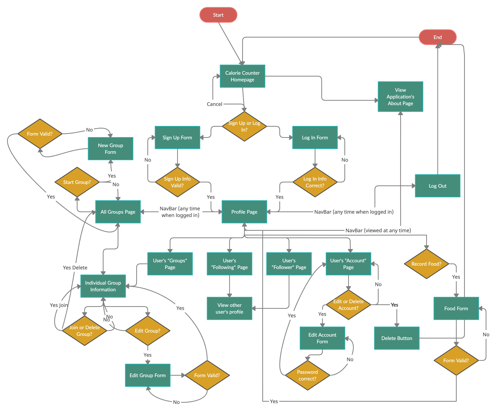
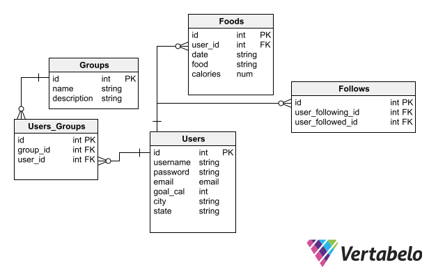

# Calorie Counter

Link to deployed site via Heroku:

## Across almost all demographics of people, health and wellness is an overall priority and concern; however, many people struggle with maintaining a healthy diet even when they set goals for themselves. An attainable way to either begin or keep up with a health and wellness journey is to set a daily caloric intake goal. A daily caloric intake goal can be kept track of by adding up the number of calories per food item eaten in a day and comparing it to the goal amount. Unfortunately, the amount of calories for food items aren't common knowledge for most people. In addition, many people struggle with their goals when they feel like they are alone so knowing other people are on a similar journey can be comforting and beneficial to goal success.

**Calorie Counter** was designed to meet the needs of people looking to keep themselves accountable for their daily caloric intake goals as well as provide a space to gain a network of support from likeminded individuals all in one application. At the homepage of the application, users are able to learn more about the application, sign up for an account, or log in to an already registered account. After registration and/or logging in, users are redirected to their profile page, where they can view their journal and past entries, register new food items to their journals, view and join support groups with similar users, and follow or be followed by different individual users in order to see other people's journals.

### Features

-----LIST FEATURES HERE

### API Info

*The CalorieNinjas API (https://api.calorieninjas.com/)* is used to search up the different food items that are inputted by the user to receive the caloric count for that input. Users will be able to view their inputs along with the calorie count provided from the API on their profile page. Inputs are organized by date and can be edited or deleted if necessary.

### Database Models

This application uses four models: User, Group, User_Group, and Follows. The User model saves the user_id, username, hashed password, email, goal_cal, city, and state to the database. The Group model saves the group_id, name, and description to the database. The User_Group model saves the user_group_id, foreign key of group_id from Group model, and foreign key of user_id from User model to the database. The Follows models saves a follows_id, and two foreign keys both from the User model: user_following_id and user_followed_id to the database.

User signup, login, and logout functionality was implemented, as well as authentication and authorization. An account is required to access any of the detailed pages for different groups, users, and API functionality. Username and email must both be unique.

### Technologies

Python, Flask, PostgreSQL, SQLAlchemy, Javascript, Bootstrap, Flash Messaging, WTForms.

### Installation 

To run this code locally, clone this repository to your computer, set up a virtual environment, and install the requirements. Create a local database and test database in PostgreSQL, and update the app config database variables in app.py and various test files. *The CalorieNinjas API is free (https://api.calorieninjas.com/)* but in order to use, the acquisition of an API Key is required. May set the required API Key in the secret.py file.

### Testing

To run tests, use Python: run all tests in VSCode, or use the terminal command "python -m unittest" to run all tests. To run test files individually, use the terminal command "python -m unittest <filename>". Test files can be found here: *(https://github.com/taylorwagner/caloriecountercapstone1/tree/main/tests)*